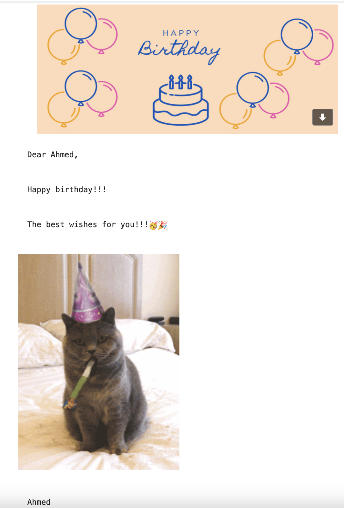

# Birthday Wishes Email To Friends

## Project Intro/Objective

The purpose of this project is using smtplib package to email friends for thier birthdays and make the code run on the cloud.

### Packages Used
* smtplib
* datetime
* pandas
* random
* time
* MIMEText

## Project Description

Reading the data and check the current day and month, if the day and month match one of the data
it will pick a random letter and GIF to email it to the lucky person. 🥳🎉

## Content

- Reading the data
- Check the current date
- Pick one of the letters
- Pick one of GIF images
- Email the letter to the birthday person
- Using time to delay 
- run the code on pythonanywhere

 

## Output
 

